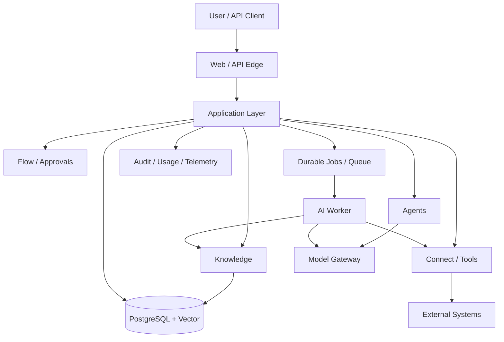

# Architecture Overview

**Status:** Foundation / Draft  
**Project:** APOTHEM AI  
**Canonical domain:** `apothemai.com.br`

## Architectural style

Start with a **modular monolith / modular platform in a monorepo**, split into independently deployable delivery surfaces where operationally useful: site, product web, API and background AI/worker runtime. Preserve strong bounded-context boundaries so high-load or high-risk components can be extracted later.

## Layers

### Delivery
HTTP API, web routes, webhook endpoints, streaming channels. Contains transport concerns, not business rules.

### Application
Use cases/commands coordinating domain objects, authorization, repositories and jobs.

### Domain
Tenant, agents, knowledge, tools, workflows, approvals and execution state. Provider/framework independent.

### Infrastructure
PostgreSQL, object storage, queues, model providers, email, OAuth, connector SDKs and observability.

## Key architectural separations

- **Conversation vs Run:** conversational UX cannot be the only execution record.
- **Agent vs AgentVersion:** mutable identity/configuration vs immutable executable snapshot.
- **Connection vs Tool:** authentication/channel vs typed operation.
- **Knowledge Source vs Indexed Chunk:** source lifecycle is distinct from retrieval representation.
- **Application log vs Audit event:** diagnostic telemetry differs from immutable security/business evidence.
- **Model provider vs model policy:** agent intent defines capability/policy; gateway selects actual provider/model.

## Extraction seams

Potential future separate services: ingestion/indexing, workflow engine, model gateway, connector execution, usage/billing. Extraction should be triggered by scaling/security/reliability or ownership requirements, not by file count.

## Component responsibilities in more detail

### API/Application host
Owns request authentication, tenant/workspace resolution, synchronous commands/queries, resource lifecycle and creation of durable work. It should not perform long LLM or ingestion loops inside request handlers.

### AI worker/runtime
Consumes durable run/job identifiers and performs long-lived orchestration. It is horizontally scalable and stateless between steps except for persisted execution state. Worker death must cause retry/recovery rather than loss of the run.

### Model Gateway
Provides normalized provider interface, routing, capability checks, usage normalization and error classification. It does not decide business authorization.

### Knowledge subsystem
Owns source lifecycle, parsing/index materialization and permission-aware retrieval. It exposes evidence contracts to runtime; the runtime should not directly query vector tables ad hoc.

### Connect/tool subsystem
Owns external connection metadata, credential references, tool schemas/executors and external-call normalization. It is the only layer allowed to turn an authorized tool request into external API/database action.

### Policy / approval subsystem
Evaluates whether a proposed capability is allowed now, requires human authorization or is denied. Policy decisions are recorded before high-risk side effects.

### Control subsystem
Consumes execution, audit, usage and evaluation facts for operational visibility. It should not become the only place state is stored; it is a view/governance layer over authoritative domain records.

## Sync vs async decision rule

Use synchronous paths for quick resource management and reads where the outcome is known within normal request latency. Use durable asynchronous paths when work depends on models, external systems, large files, retries, schedules or human decisions.

The boundary is product-relevant: asynchronous operations return a resource with state and progress, not an opaque “processing” toast that cannot be recovered after refresh.

## Transaction boundaries

A database transaction should encompass local state that must commit atomically: creating a run plus outbox event, publishing a version plus active pointer update, recording an approval decision. External network/model calls should occur outside long DB transactions. Where local state and external side effect cannot be atomically committed, model the attempt/idempotency and reconcile.

## Failure model

Failures are classified rather than all becoming `500`:
- invalid configuration/input;
- authorization/policy denial;
- provider rate limit/unavailable;
- connector authentication revoked;
- external validation/business error;
- timeout;
- budget/quota exceeded;
- internal invariant violation;
- cancelled/expired.

Classification determines retry, user message and operational alert behavior.

## Architectural fitness checks

During implementation, periodically verify:
- provider SDK types have not leaked into domain/contracts;
- tenant IDs are present in repository/job/cache boundaries;
- a published version remains immutable;
- side effects have idempotency/policy records;
- long-running work survives process restart;
- web UI can recover run state after reconnect;
- audit is not substituted by console/application logs.
