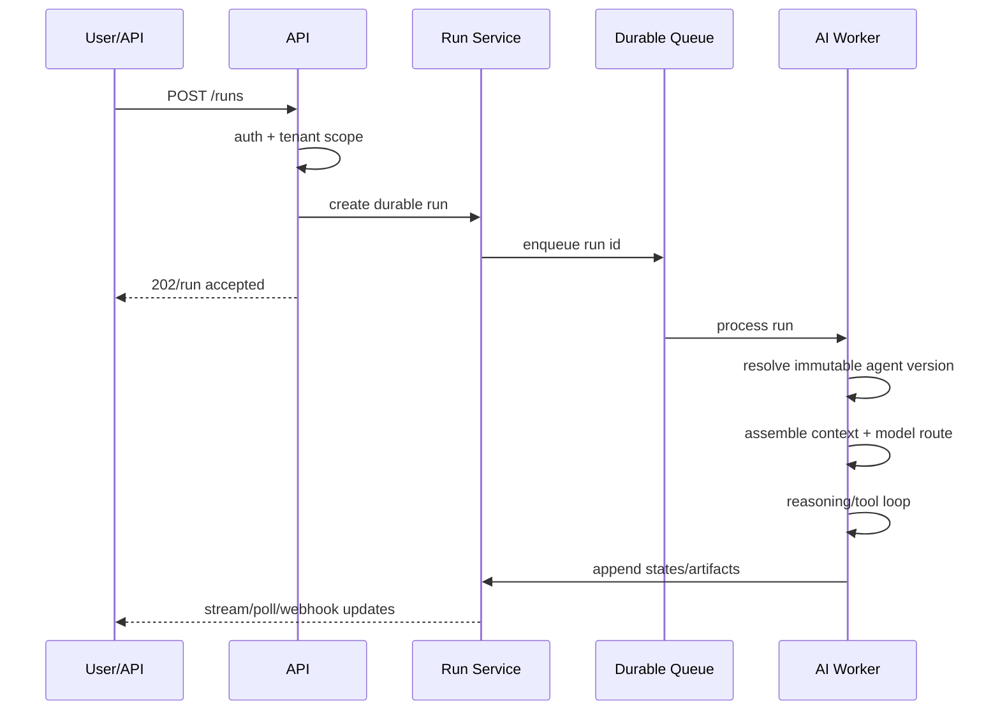

# Request and Execution Lifecycle

**Status:** Foundation / Draft  
**Project:** APOTHEM AI  
**Canonical domain:** `apothemai.com.br`

## Synchronous CRUD request
`authenticate → resolve tenant/workspace → authorize capability → validate input → execute use case → persist → audit if privileged → return normalized response`.

## Agent run request

A user disconnecting from streaming must not cancel the durable run unless an explicit cancellation command is authorized.
