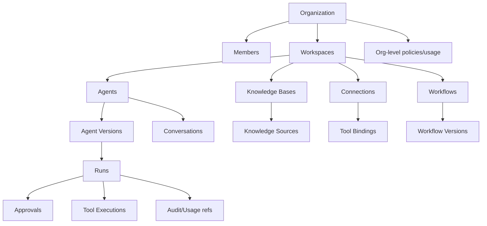

# Domain Model

**Status:** Foundation / Draft  
**Project:** APOTHEM AI  
**Canonical domain:** `apothemai.com.br`

## Ownership hierarchy

## Entity identity
Use opaque globally unique identifiers (UUID/ULID-style) and never derive authorization from guess-resistant IDs. Human-friendly slugs/names are secondary identifiers.

## Lifecycle philosophy
Most business resources are archived/disabled rather than hard-deleted when historical runs depend on them. A data deletion request may trigger retention/anonymization processes without corrupting required audit relationships.

## Core invariants
- Every tenant-owned aggregate has organization scope.
- Workspace-scoped resources also carry workspace identity.
- Published AgentVersion/WorkflowVersion is immutable.
- Run references the exact effective version.
- Approval proposal cannot mutate after issuance.
- Tool execution records policy decision before performing a gated side effect.
- Audit event is append-only from application perspective.

## Aggregate boundaries

### Organization aggregate
Controls tenant identity/status and organization-wide policy references. Membership may be managed in an identity/tenancy module with Organization as ownership boundary to avoid loading all members for every organization mutation.

### Agent aggregate
Agent identity plus draft/publication lifecycle. AgentVersion is immutable and can be stored separately for efficient history. Changing active version is a controlled command.

### Knowledge Source aggregate
Controls source processing/synchronization lifecycle. Chunks/index rows are materialized children and may be rebuilt; source status/version is authoritative.

### Connection aggregate
Controls external account identity, credential reference and health/revocation. Tool Definitions are connector-level capability metadata; Tool Bindings are workspace/agent scoped.

### Run aggregate / execution record
Controls execution state machine and high-level result. Detailed timeline/tool attempts may be append-only children to avoid rewriting a growing run row.

### Approval aggregate
Owns immutable proposal + final decision. The approval is not a boolean column on ToolExecution because it has actors, timestamps, expiration, comments and independent authorization.

## Important state transitions

### Agent
`DRAFT/INACTIVE → ACTIVE → DISABLED → ARCHIVED`; publishing creates versions independently of status.

### Knowledge Source
`PENDING → PROCESSING → READY`, with `FAILED/PARTIAL/STALE/DISABLED` paths. A stale source may remain searchable according to policy but UI must communicate freshness.

### Connection
`PENDING_AUTH → ACTIVE → DEGRADED → EXPIRED/REVOKED/DISCONNECTED`.

### Run
`QUEUED → RUNNING → WAITING_APPROVAL → RUNNING → COMPLETED/FAILED/CANCELLED`.

### Tool attempt
`PROPOSED → VALIDATED → POLICY_EVALUATED → WAITING_APPROVAL/READY → EXECUTING → SUCCEEDED/FAILED/DENIED/CANCELLED`.

## Deletion and referential history

Physical cascading delete is dangerous for a platform whose value includes auditability. Archive/disable primary objects when historic executions reference them. For legally required erasure, introduce a controlled deletion/anonymization workflow that can remove business content and secrets while preserving minimal non-content evidence where retention is permitted/required.

## Domain events vs audit events

A domain event informs other application modules that business state changed. An audit event records a security/business fact for investigation/compliance. Some actions produce both, but they are not the same stream or retention promise.

Example: `agent.version_published` domain event may trigger cache invalidation; audit event additionally records actor/IP/request/capability/resource metadata.

## Naming discipline

Use the domain vocabulary in API/database/code. Avoid multiple synonyms such as “bot”, “assistant”, “persona” for Agent unless they are product-facing aliases. Consistent names are especially important because coding agents will use documentation to infer entities.
