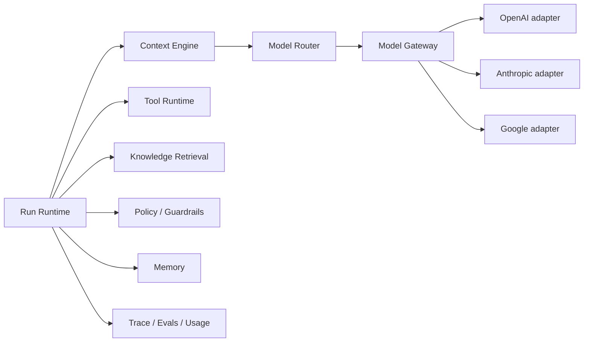

# AI Architecture

**Status:** Foundation / Draft  
**Project:** APOTHEM AI  
**Canonical domain:** `apothemai.com.br`

APOTHEM separates the product concept of an agent from provider-specific LLM APIs.

The application asks for capabilities/policies; adapters normalize provider message formats, tool calls, structured outputs, usage and errors.

Reasoning loops must have explicit limits: max turns/tool calls/time/cost. The runtime should terminate predictably rather than allowing an unbounded agent loop.
