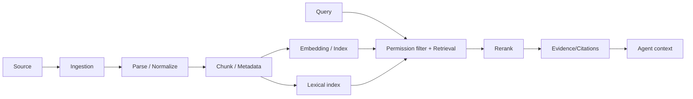

# Knowledge Architecture

**Status:** Foundation / Draft  
**Project:** APOTHEM AI  
**Canonical domain:** `apothemai.com.br`

APOTHEM Knowledge is a permission-aware enterprise retrieval layer, not merely file upload + embeddings.

The source document remains authoritative. Index materialization should be rebuildable.

Retrieval must enforce authorization before context reaches the model. Filtering after model generation is too late.

## Permission-before-retrieval requirement

Authorization cannot be implemented by retrieving global nearest neighbors and filtering after the fact if unauthorized content might already influence reranking/model context. Query planning must constrain eligible tenant/workspace/base/source records before evidence is returned to the agent.

At minimum, every chunk/index record can be mapped back to organization/workspace/source and access policy. If external ACL inheritance is added later, effective permissions must be synchronized or checked in a way that scales without leaking candidates.

## Freshness and synchronization

Enterprise knowledge is not static. Sources expose `last_discovered`, `last_processed`, `source_revision` and sync status. Agents may have policy such as “only use sources updated within N days” for particular use cases. When a connector revokes permission, the system should promptly mark its materialization ineligible even before background cleanup completes.

## Retrieval plan

Initial retrieval can combine:
1. metadata/permission filter;
2. lexical full-text candidates;
3. vector candidates;
4. score fusion;
5. optional reranking;
6. diversity/deduplication;
7. token-budget selection;
8. evidence packaging.

This pipeline must be observable enough to answer why an expected document was not retrieved.

## Data formats

PDF/DOCX/text are suitable for chunk retrieval. CSV/XLSX and databases may need structured query tools rather than converting every value into prose chunks. The platform should support multiple knowledge strategies under one Knowledge concept.

## Ingestion security

Uploaded/connector documents are untrusted content. Parsing runs with file size/type limits and ideally sandboxed/isolated parsers for risky formats. Extracted text must not be treated as trusted instructions. Malware scanning may become necessary for enterprise file ingestion.

## Knowledge evaluation

Build known-answer corpora per design partner. Each question maps to expected source/item and acceptable evidence. Measure retrieval recall and citation correctness separately from final answer quality. A good LLM cannot compensate for permission-wrong or source-missing retrieval.
