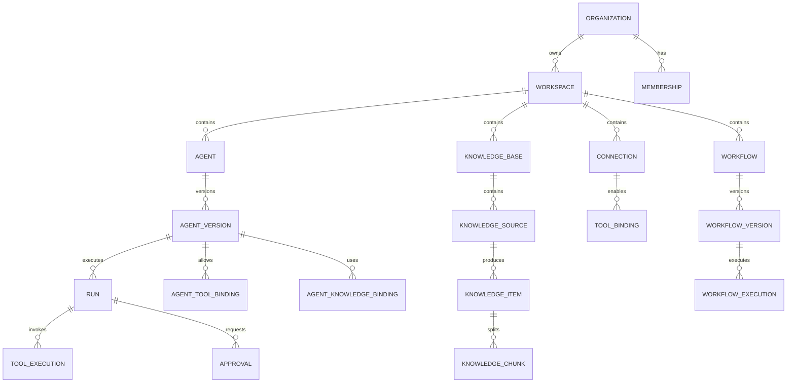

# Initial ERD

**Status:** Foundation / Draft  
**Project:** APOTHEM AI  
**Canonical domain:** `apothemai.com.br`

This is conceptual. Physical table normalization and polymorphic bindings should be chosen during migrations while preserving these ownership relationships.
